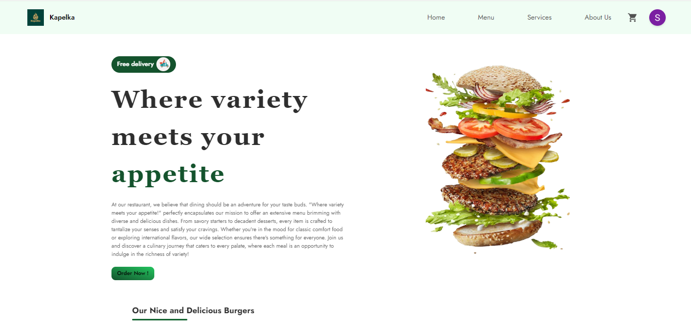

Ce référentiel contient l’application Food-App, une application complète conçue pour la gestion des restaurants, avec un tableau de bord utilisateur, une gestion des produits, la gestion des commandes, etc.



# Pour vérifier la version du node

```
node --verion
```

# Pour initialiser la console Firebase

```
firebase init
```

# Pour démarrer le serveur

```
npm run serve
```

# Pour tester l’application, accédez à la page d’accueil et actualisez-la après chaque modification. Toutes les fonctionnalités sont accessibles dans le tableau de bord.

# Étapes pour lancer l’application

```
1. cd Food-App
2. cd server
3. npm install firebase-tools --save-dev
4. cd functions
5. npm install
6. npm run serve
```

# Démarrer le coté client

# Ouvrez un deuxième terminal et exécutez les commandes suivantes :

```
cd Food-App
cd Client
rm yarn.lock
yarn install
yarn start
```

